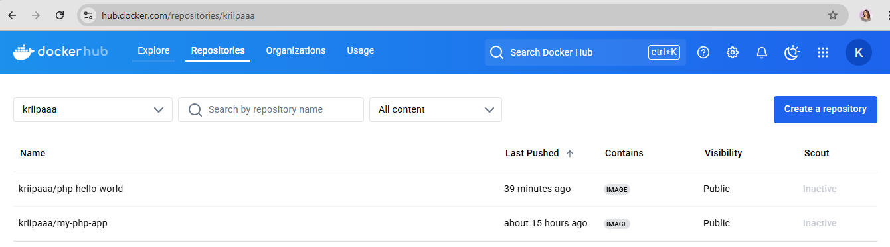

# DevOps Task: Dockerizing a PHP Web Application

## Submitted by Kripa Acharya  
Batch 2025 | CSIT | 1120  

## Task Overview
This project involves setting up a PHP web application using Docker and Docker Compose, then pushing the Docker image to Docker Hub. The following steps outline the process to successfully complete the task.

## Prerequisites
- An AWS EC2 instance (Ubuntu)
- PuTTY for SSH connection
- Docker & Docker Compose installed on the instance
- A Docker Hub account
- Git installed on the instance

## Step-by-Step Guide

### 1. Create a Public GitHub Repository
- Repository URL: [PowerWorkshop-DevOps](https://github.com/kripaa7/powerworkshop-DevOps)

### 2. Setup an EC2 Instance & Connect via PuTTY
- Created an EC2 instance with the public IP `54.226.235.200`.
- Connected using PuTTY.

### 3. Install Docker & Docker Compose
Run the following commands:
```sh
sudo apt update
sudo apt install docker.io
sudo apt install docker-compose
```

### 4. Fork and Clone the PHP Hello World Repository
```sh
git clone https://github.com/silarhi/php-hello-world.git
cd php-hello-world
```

### 5. Create an `index.php` File
Create an `index.php` file inside the cloned repository:
```php
<?php
require_once __DIR__ . '/src/HelloInterface.php';
require_once __DIR__ . '/src/Hello.php';

use Silarhi\Hello;

$hello = new Hello();
echo $hello->display();
```

### 6. Create a `Dockerfile`
Create a `Dockerfile` in the project root:
```dockerfile
FROM php:7.4-apache
COPY . /var/www/html/
EXPOSE 80
CMD ["apache2-foreground"]
```

### 7. Build the Docker Image
```sh
sudo docker build -t php-hello-world .
```

### 8. Push the Image to Docker Hub
1. Log in to Docker Hub:
    ```sh
    docker login -u <dockerhub_username>
    ```
2. Tag and push the image:
    ```sh
    docker tag php-hello-world <dockerhub_username>/php-hello-world:latest
    docker push <dockerhub_username>/php-hello-world:latest
    ```

### 9. Create a `docker-compose.yml` File
Create a `docker-compose.yml` file in the project directory:
```yaml
version: "3"
services:
  app:
    image: <dockerhub_username>/php-hello-world:latest
    build: .
    ports:
      - "8000:80"
```

### 10. Run the Application Using Docker Compose
```sh
sudo docker-compose build
sudo docker-compose up -d
```

### 11. Verify the Running Application
- Visit `http://<EC2_PUBLIC_IP>:8000` in a browser to see the PHP output.

### 12. Upload the Code to GitHub
- Commit and push all files to the [GitHub repository](https://github.com/kripaa7/powerworkshop-DevOps).

## Screenshots
**Application Running on Docker:**


**Docker Compose Output:**


**Docker images and containers:**

## Conclusion
This project successfully sets up a Dockerized PHP application, pushes the image to Docker Hub, and runs it using Docker Compose. Following this guide will allow anyone to replicate the setup on their own environment.
